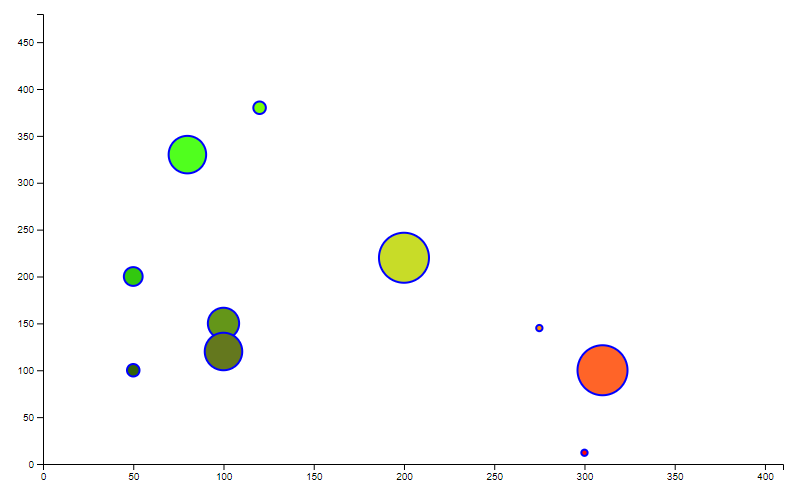
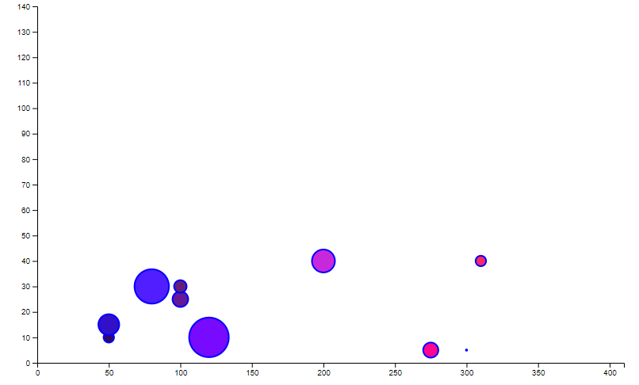

# interactive-bubble-chart
This repository contains the project for the Information Visualization course.
## Launching the script
Navigate to the folder where the `index.html` is located
and start a server using Python3 with the command `python -m http.server 8080`  
Then, open your browser on `localhost:8080`.

